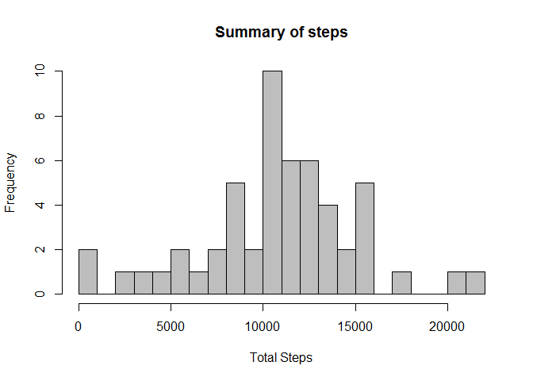

# Reproducible Research : Assignment 1

#### Environment Details

R version 3.1.0 (2014-04-10)
Platform: x86_64-w64-mingw32/x64 (64-bit)

locale:
[1] LC_COLLATE=English_Australia.1252  LC_CTYPE=English_Australia.1252   
[3] LC_MONETARY=English_Australia.1252 LC_NUMERIC=C                          
[5] LC_TIME=English_Australia.1252       

attached base packages:  
[1] stats     graphics  grDevices utils     datasets  methods   base     

other attached packages:  
[1] boot_1.3-11

loaded via a namespace (and not attached):  
[1] tools_3.1.0


Reading the activity file and converting Date column from factor to Date format

```r
activity <- read.csv("./data/activity.csv")
activity[,2]<-as.Date(activity[,2],format="%Y-%m-%d")
```

Plotting the total steps per day

```r
a<-aggregate( steps~date, activity, sum, na.action=na.pass )
hist(a$steps, breaks=25, xlab="Total Steps", main="Summary of steps", col=8)
```

 

```r
mean_of_daily_totals <- as.character(mean(a[,2],na.rm=TRUE))
median_of_daily_totals <- as.character(median(a[,2],na.rm=TRUE))
```
The mean is 10766.1886792453  
The median is 10765


Average daily activity pattern  


```r
b<-aggregate( steps~interval, activity, mean, na.action=na.omit )
plot(b$interval, b$steps, type="l", col="blue", xlab="Interval", ylab="Average steps", main="")
```

 

```r
b1<- subset(b,b$steps==max(b$steps))
print(b1$interval)
```

```
## [1] 835
```
The interval with the maximum number of steps is 835
