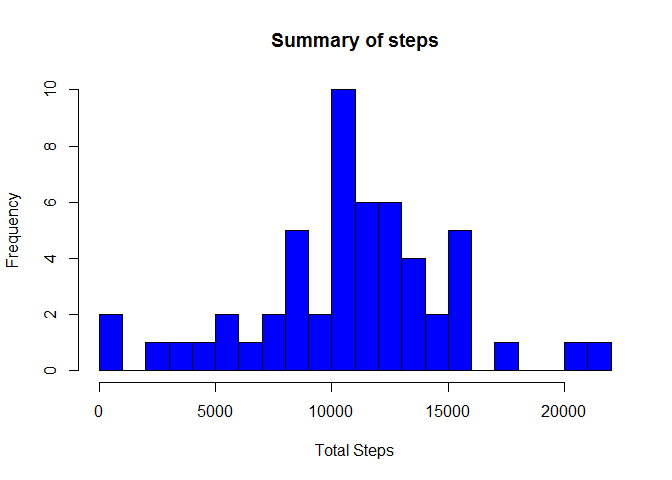
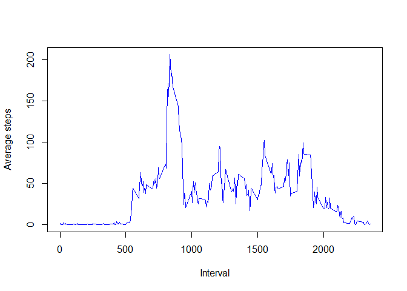
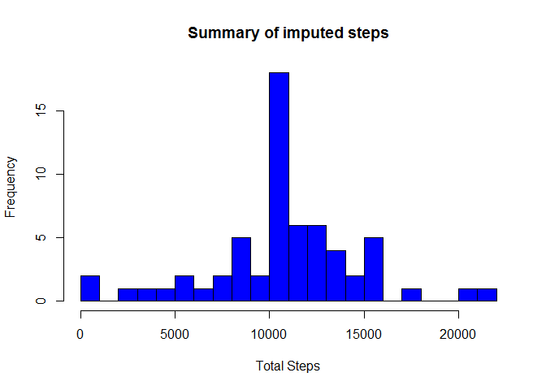
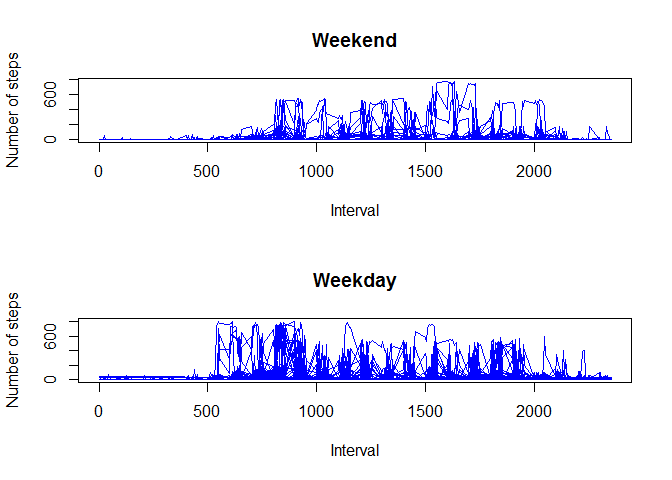

# Reproducible Research : Assignment 1

#### Environment Details


```r
sessionInfo()
```

```
## R version 3.1.0 (2014-04-10)
## Platform: x86_64-w64-mingw32/x64 (64-bit)
## 
## locale:
## [1] LC_COLLATE=English_Australia.1252  LC_CTYPE=English_Australia.1252   
## [3] LC_MONETARY=English_Australia.1252 LC_NUMERIC=C                      
## [5] LC_TIME=English_Australia.1252    
## 
## attached base packages:
## [1] stats     graphics  grDevices utils     datasets  methods   base     
## 
## loaded via a namespace (and not attached):
## [1] digest_0.6.4     evaluate_0.5.5   formatR_0.10     htmltools_0.2.4 
## [5] knitr_1.6        rmarkdown_0.2.49 stringr_0.6.2    tools_3.1.0     
## [9] yaml_2.1.13
```

#### Start of the assignment 

#####  Loading and preprocessing the data  

Reading the activity file and converting Date column from factor to Date format

```r
activity <- read.csv("./data/activity.csv")
activity[,2]<-as.Date(activity[,2],format="%Y-%m-%d")
```
  
##### Plotting the total steps per day  

```r
a<-aggregate( steps~date, activity, sum, na.action=na.pass )
hist(a$steps, breaks=25, xlab="Total Steps", main="Summary of steps", col="blue")
```

 

```r
mean_of_daily_totals <- as.character(round((mean(a[,2],na.rm=TRUE)), digits=2))
median_of_daily_totals <- as.character(round((median(a[,2],na.rm=TRUE)), digits=2))
```
The mean is 10766.19  
The median is 10765


##### Average daily activity pattern    


```r
b<-aggregate( steps~interval, activity, mean, na.action=na.omit )
plot(b$interval, b$steps, type="l", col="blue", xlab="Interval", ylab="Average steps", main="")
```

 

```r
b1<- subset(b,b$steps==max(b$steps))
print(b1$interval)
```

```
## [1] 835
```
The interval with the maximum number of steps is 835

##### Imputing missing values    
Derive values to impute based on average per interval over the entire dataset    
Create the new dataset with the imputed values in place of "NA"  
Make a histogram with total steps taken each day    
compare with first step the difference in mean and median  


```r
##c<-subset(activity, is.na(steps) | is.na(date) | is.na(interval))
c1<-merge(activity, b , by="interval")
for(i in 1:length(c1$steps.x))
    {if (is.na(c1$steps.x[i])) 
        {c1$steps.x[i] <- c1$steps.y[i]
        }
    }
c1 <- subset(c1, select=c(1:3))
c2<-aggregate( steps.x~date, c1, sum)
hist(c2$steps.x, breaks=25, xlab="Total Steps", main="Summary of imputed steps", col="blue")
```

 

```r
impMean<- as.character(round(mean(c2[,2]),digits=2))
impMedian<- as.character(round(median(c2[,2]),digits=2))
```
The mean of the orginal dataset was '10766.19' and with the imputed values it is '10766.19'  
The median of the orginal dataset was '10765' and with  the imputed values it is '10766.19'  

##### Plotting differences in activity patterns between weekdays and weekends


```r
d<- transform(c1, weekend=as.POSIXlt(date, format='%Y/%m/%d')$wday %in% c(0, 6))
wEnd<- subset(d,d$weekend==TRUE)
wDay<- subset(d,d$weekend==FALSE)

wEndAve<-aggregate( steps.x~interval+date, wEnd, mean)
wDayAve<-aggregate( steps.x~interval+date, wDay, mean)

par(mfrow=c(2,1))
plot(wEndAve$interval, wEndAve$steps.x, type="l", col="blue", main="Weekend", xlab="Interval", ylab="Number of steps")
plot(wDayAve$interval, wDayAve$steps.x, type="l", col="blue", main="Weekday", xlab="Interval", ylab="Number of steps")
```

 
